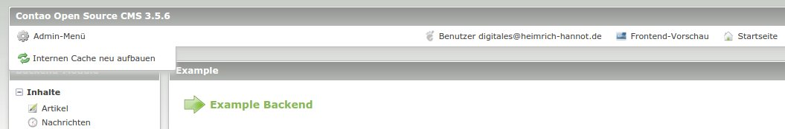

# Backend Admin Menu

Extends the contao backend with a menu containing useful shortcuts.



*Preview*

## Features

### Currently available actions

- regenerate the internal cache
- open composer
- open the page for updating the database

## Technical instructions

### Add a new action

Simply add a new entry to ```$GLOBALS['TL_CONFIG']['backendAdminMenuActions']```

```
$GLOBALS['TL_CONFIG']['backendAdminMenuActions']['generate_internal_cache'] = array(
    // either use a direct url...
    'href' => 'contao/main.php?do=composer',
    // ... or a callback as href
    'href' => array('Some\Namespace\SomeClass', 'someMethod'),
    'icon' => 'system/modules/some/icon.png'
);
```